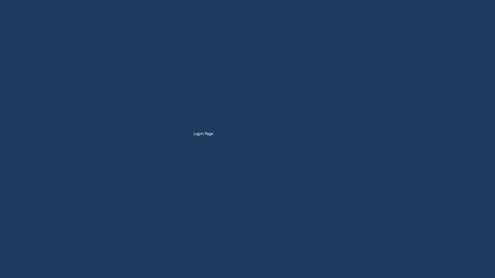
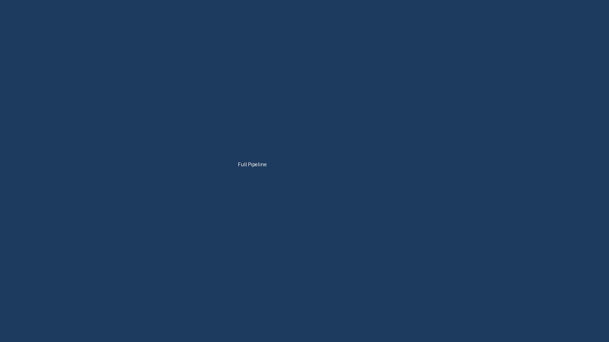

# ⚙️ AutoCRM AI — CRM售前及售后业务场景AI解决方案

> 用AI大模型重构CRM全流程：售前92 + 售后51 = **143个AI场景** + 6大Agent体系 + 10项通用AI能力

[](https://python.org)
[](https://github.com/langchain-ai/langgraph)
[](LICENSE)

---

## 项目截图

### 登录页


### 工作台


### 全流程场景


### Agent页面


---

## 项目背景

企业CRM存在三大核心问题：

1. **售后信息碎片化** — 故障描述散落在工单、电话、聊天记录中，技师凭经验诊断，耗时长误诊率高
2. **售前销售记录沉睡** — 历史数据、客户对话未被有效利用，商机推进靠感觉，赢率预测不准
3. **CRM操作繁琐** — 销售每天2-3小时耗在系统操作，录入敷衍→数据失真→管理决策失效

> **传统CRM是"被动记录系统"——人录入、人查询、人判断。**
> **本方案把它变成"主动智能助手"——AI理解、AI建议、AI执行。**

### 业务数据来源

本方案的所有业务场景、痛点分析、流程设计均来自真实项目经验：

| 来源 | 内容 | 覆盖范围 |
|------|------|----------|
| 比亚迪售后系统 | 故障诊断、保修索赔、工单派工流程 | 售后9个业务环节 |
| 瑞能×纷享销客CRM项目 | LTC商机经营、客户360、销售自动化 | 售前15个业务环节 |
| 泛微九氚汇CRM方案 | 数字名片、营销效果验证、微信协同 | 补充差异化功能 |
| 《售前LTC业务AI场景清单》 | 92个售前AI落地场景、12种AI助手类型 | 完整LTC全流程 |
| 《纷享销客CRM AI销售Agent产品白皮书》 | 6大Agent架构、嵌入式AI理念 | AI平台参考架构 |

---

## 🗺️ 售前LTC全流程AI场景（67个）

基于《售前LTC业务AI场景清单》，覆盖从线索到回款的完整LTC流程：

```
🔍 线索获取(4) → 🤝 线索转化(4) → 👥 客户管理(4) → 🔗 联系人管理(5) → 💼 商机管理(4) → 📋 方案与报价(4) → 📝 招投标与合同(3)
→ 📦 订单与交付(3) → 💰 回款与续费(4) → 🎯 目标管理(5) → 📊 销售复盘与赋能(4) → 📈 管理层经营分析(3)
→ 📊 BI与数据分析(4) → 🤖 Agent工作流(6) + 🔧 10项通用AI能力
```

### 各阶段AI场景明细

| LTC阶段 | 场景数 | AI场景 |
|---------|-------|--------|
| **线索获取** | 4 | 线索智能挖掘、线索去重与归并、线索质量评分、线索画像补全 |
| **线索转化** | 4 | 首次沟通话术建议、会议助手与纪要生成、沟通内容结构化、客户需求识别 |
| **客户管理** | 4 | 客户信息自动补全、客户关系图谱、客户健康度评分、客户流失预警 |
| **联系人管理** | 5 | 联系人关系图谱构建、联系人组织关系拓扑、关键联系人角色识别、联系人互动历史分析、联系人网络拓扑可视化 |
| **商机管理** | 4 | 商机阶段自动识别、商机赢率预测、关键人识别、风险预警 |
| **方案与报价** | 4 | 方案生成助手、竞品对比摘要、报价合理性建议、报价单校验 |
| **招投标与合同** | 3 | 标书要点抽取、合同风险审阅、审批材料自动整理 |
| **订单与交付** | 3 | 交付里程碑跟踪、客户异常反馈聚合、验收材料整理 |
| **回款与续费** | 4 | 回款风险预警、催收话术生成、回款计划调整、续费/二次销售触发 |
| **目标管理** | 5 | 销售目标达成看板、验收目标跟踪、回款目标达成分析、目标分解与对齐、目标预测与调整建议 |
| **销售复盘与赋能** | 4 | 销冠方法论总结、个人行为诊断、知识库自动沉淀、培训内容个性化推荐 |
| **管理层经营分析** | 3 | 预测性业绩看板、业绩异常解释、团队资源配置建议 |
| **BI与数据分析** | 4 | 自然语言BI查询、指标口径自动校验、异常波动归因、预测与情景分析 |
| **Agent工作流** | 6 | 语音创建客户、语音创建报价单、语音创建商机、语音创建合同/审批流、批量数据导入建档、跨系统任务联动 |

## 🔧 售后服务全流程AI场景（36个）

基于行业经验+TIS远程诊断+BOM物料系统+质保体系，覆盖从报修到结案的全链路：

```
📞 客服与报修(4) → 📋 工单与派工(4) → 🔍 故障诊断(5) → 🔧 维修执行(4) → 📦 领料与出库(4)
→ ✅ 竣工与验收(4) → 💰 索赔申请与审核(5) → 💳 索赔回款与结案(4) → 🔄 供应商反向索赔(4)
```

| 售后阶段 | 场景数 | AI场景 |
|---------|-------|--------|
| **客服与报修** | 4 | 400热线智能接听、报修信息自动录入、报修意图识别与分流、重复报修智能合并 |
| **工单与派工** | 4 | 工单自动创建与填充、智能派工推荐、工单优先级排序、工程师技能画像匹配 |
| **故障诊断** | 5 | TIS系统故障自动检测、上位机故障自动上报、故障解决方案智能匹配、故障根因分析、维修标准处理流程推送 |
| **维修执行** | 4 | 维修过程引导、维修记录自动生成、维修异常实时预警、小程序到达/签到确认 |
| **领料与出库** | 4 | BOM物料智能匹配、质保校验-保内外判断、总成零部件关系自动追溯、库存可用性预测与备货 |
| **竣工与验收** | 4 | 竣工条件自动校验、维修质量评估、客户验收确认推送、外勤报销智能审核 |
| **索赔申请与审核** | 5 | 索赔资格自动校验、索赔材料自动整理、索赔金额智能核算、索赔风险审核、索赔审批流程自动化 |
| **索赔回款与结案** | 4 | 索赔回款进度跟踪、回款异常识别、结案条件自动校验、结案报告自动生成 |
| **供应商反向索赔** | 4 | 供应商责任自动认定、反向索赔金额核算、供应商索赔趋势分析、供应商索赔协同流程 |

### 关键行业系统AI对接

| 系统 | AI能力 | 开发优先级 |
|------|--------|-----------|
| TIS远程诊断 | 故障码自动解析+根因分析 | P0 |
| 上位机(PLC/SCADA) | 设备告警自动接收+预警工单 | P1 |
| BOM物料系统 | 总成/零部件匹配+质保校验 | P0 |
| 仓库管理系统(WMS) | 备件库存查询+领料出库 | P1 |
| 质保政策引擎 | 标准质保+协议质保+保内外判定 | P0 |
| 小程序(客户/工程师端) | 到达签到+验收确认+评价 | P1 |

### 10项通用AI能力

| 能力 | 说明 | 适用角色 |
|------|------|----------|
| AI智能问答 | 产品/技术问题智能解答 | 销售/售前/客服 |
| AI智能报表 | 销售数据智能分析与报告生成 | 管理层/销售经理 |
| AI知识库 | 沉淀产品/案例/FAQ并支持智能检索 | 全员 |
| AI智能预警 | 客户流失风险/合同到期/异常行为预警 | 销售经理/客服 |
| AI文档生成 | 自动生成合同/方案/技术支持文档 | 售前/法务 |
| AI语音识别 | 会议录音转文字与关键词提取 | 销售/售前 |
| AI邮件助手 | 邮件智能分析/自动回复/优先级排序 | 销售/客服 |
| AI竞品分析 | 竞争对手情报收集、价格策略分析 | 销售/市场 |
| AI培训助手 | 个性化培训推荐、能力评估 | 销售/新人 |
| AI智能审批 | 自动化审批流程、智能风险评估 | 管理层/法务 |

---

## 🤖 6大Agent体系

基于《纷享销客CRM AI销售Agent产品白皮书》，构建6大Agent：

### 1. 🕵️ 情报Agent
- 企业工商、舆情、招投标、财报等信息自动获取
- AI信息提取：客户详情页一键丰富信息
- AI情报订阅：自定义订阅维度与数据源
- AI情报洞察与建议：机会与风险洞察
- 招投标信息AI挖掘：精准标讯关联度识别

### 2. 💬 客户互动Agent
- 多模态语料转写：在线会议/电话/录音/文件导入
- 发言人洞察：态度/关注点/顾虑/竞对信息
- 销售表现洞察：对话技巧/SOP执行质检/对话建议
- 互动摘要：关键信息提取/重点议题/互动评价
- 互动话题助手：AI建议互动话题/实时引导
- 待办助手：自动提取疑似待办/转入CRM任务
- 需求管理：互动需求提取/客户需求管理

### 3. 👤 客户画像Agent
- **线索画像(BANT)**：预算/权限/需求/时间线评估
- **客户画像**：多维度AI洞察/综合评分/状态洞察/行动建议
- **商机画像(C139)**：1个决定力+3个趋赢力+9个必清事项
- 赢率评估：赢单区/抖动区/输单区可视化
- 画像动态更新：基于互动语料自动补全

### 4. ⚡ 工作赋能Agent
- GAP分析建议：目标达成差距与行动建议
- 重点商机洞察与建议
- 风险预警：停滞/竞争/异常预警
- AI工作建议：智能推荐下一步行动
- AI业务报告：日/周/月/季/年报告自动生成
- 销售工作台：一站式工作入口

### 5. 🎯 销售建议Agent
- 智能风险提示：商机风险/合同风险/流失风险
- 销冠方法论复制：提炼赢单关键动作和必清事项
- 智能销售教练：模拟销售过程/实时陪练
- 差异化分析：竞品对比与差异化卖点推荐

### 6. 📚 智能知识库
- RAG检索增强生成：智能搜索与问答
- 方案生成器：提取需求→多轮对话→模板制定→内容填充
- 知识推荐：基于场景自动推荐相关知识
- 优秀话术提取：从互动中提取话术转入知识库

---

## 🏗️ 系统架构

```
┌─────────────────────────────────────────────────────────────────────────┐
│                          交互层 (用户触点)                                │
│   [Streamlit Web]  [语音接口]  [API接口]  [企业微信/钉钉]               │
├─────────────────────────────────────────────────────────────────────────┤
│                       应用层 (143个AI业务场景)                            │
│                                                                         │
│  【售前LTC】线索获取 → 线索转化 → 客户管理 → 联系人管理 → 商机管理 → 方案报价 → 招投标合同   │
│             订单交付 → 回款续费 → 目标管理 → 复盘赋能 → 经营分析                     │
│  【售后服务】客服报修 → 工单派工 → 故障诊断 → 维修执行 → 领料出库               │
│             竣工验收 → 索赔审核 → 索赔回款结案 → 供应商反向索赔               │
│                                                                         │
│  【售后业务】报修受理 │ 智能诊断 │ 开单派工 │ 维修过程 │ 竣工结算        │
│             索赔管理 │ 供应商索赔 │ 故障率分析                            │
│                                                                         │
│  【通用能力】智能问答 │ 智能报表 │ 知识库 │ 预警 │ 文档生成 │ 语音识别    │
│             邮件助手 │ 竞品分析 │ 培训助手 │ 智能审批                      │
│                                                                         │
│  【Agent工作流】语音创建客户/报价单/商机/合同 │ 批量导入 │ 任务联动       │
│  【BI分析】自然语言查询 │ 口径校验 │ 归因分析 │ 趋势预测                  │
├─────────────────────────────────────────────────────────────────────────┤
│                      智能层 (6大Agent体系)                               │
│                                                                         │
│  ┌──────────┐  ┌──────────┐  ┌──────────┐                             │
│  │ 情报Agent │  │ 互动Agent│  │ 画像Agent│                             │
│  │·工商舆情  │  │·语料转写  │  │·BANT画像 │                             │
│  │·招投标挖掘│  │·发言人洞察│  │·C139画像 │                             │
│  │·情报订阅  │  │·互动摘要  │  │·赢率评估 │                             │
│  └──────────┘  └──────────┘  └──────────┘                             │
│  ┌──────────┐  ┌──────────┐  ┌──────────┐                             │
│  │ 赋能Agent │  │ 建议Agent│  │ 知识库   │                             │
│  │·GAP分析   │  │·风险提示  │  │·RAG检索  │                             │
│  │·AI报告    │  │·销售教练  │  │·方案生成 │                             │
│  │·工作台    │  │·方法论复制│  │·话术提取 │                             │
│  └──────────┘  └──────────┘  └──────────┘                             │
├─────────────────────────────────────────────────────────────────────────┤
│                    能力层 (AI核心能力，可插拔组合)                          │
│                                                                         │
│  [RAG检索]  [Tool Calling]  [信息抽取]  [语音处理]  [知识图谱]           │
│  [Text-to-SQL]  [规则引擎]  [缓存与记忆]  [安全护栏]  [Prompt模板]      │
├─────────────────────────────────────────────────────────────────────────┤
│                      数据层 (知识底座，持久化存储)                         │
│                                                                         │
│  [Chroma向量库]  [NetworkX知识图谱]  [SQLite业务库]  [对话记忆]          │
├─────────────────────────────────────────────────────────────────────────┤
│                    集成层 (企业系统对接，Tool Calling接口)                  │
│                                                                         │
│  [纷享销客/销售易]  [SAP/金蝶ERP]  [企业微信/钉钉]  [400客服]           │
│  权限控制：AI只访问当前用户可见的数据，操作审计日志全记录                    │
└─────────────────────────────────────────────────────────────────────────┘
```

---

## 💡 核心AI场景详解

### 场景一：售后故障智能诊断

**业务痛点**：故障描述分散，技师凭经验诊断，耗时长误诊率高

**AI解决方案**：RAG检索 + 知识图谱推理 + 多Agent协作

```
输入：设备启动困难，运行8万小时，近期降温
  │
  ├─ [信息抽取] 故障:启动困难 | 运行时长:80,000h | 环境因素:温度骤降
  ├─ [RAG检索] 查询故障案例库 → 召回3条相似案例
  ├─ [知识图谱] 查询保修状态 → 在保 + 历史维修记录
  ├─ [诊断推理] 可能原因: 核心部件衰减(60%) > 低温影响(25%) > 启动模块磨损(15%)
  └─ [Tool Calling] 创建维修工单 + 推荐技师 → WO-20260501-001
```

### 场景二：客户互动Agent — 多模态语料转写与洞察

**业务痛点**：销售现场信息遗失，管理者无法真实获取客户语言与需求

**AI解决方案**：ASR转写 → 发言人洞察 → 需求识别 → 待办提取

```
输入：客户拜访录音(15分钟)
  │
  ├─ [多模态转写] 区分发言人(我方/客方) → 自动存入销售记录
  ├─ [发言人洞察] 李总态度积极，关注交付周期；赵经理待接触
  ├─ [需求识别] 两厂区储能改造，预算500万，期望年底交付
  ├─ [待办提取] 联系赵经理确认采购对接 → 转入CRM任务
  └─ [新业务信息] 发现新联系人赵经理 → 可转入CRM
```

### 场景三：客户画像Agent — C139商机画像

**业务痛点**：商机推进靠感觉，赢率预测不准，决策链缺口未识别

**AI解决方案**：C139模型 + 动态画像 + Next Best Action

```
输入：查看商机"储能项目"的推进建议
  │
  ├─ [C139画像]
  │   ·1个决定力: 最高决策者支持 → ❌ 刘总未接触
  │   ·3个趋赢力: 价值匹配✅ 关键人员协助⚠️ 多数人选定❌
  │   ·9个必清事项: 4✅ 2⚠️ 3❌ → 处于"抖动区"
  │
  ├─ [赢率评估] 35% → 低于同阶段平均(50%)
  │
  └─ [Next Best Action]
      🔴 紧急: 安排与刘总接触(决策人缺失是最大风险)
      🟡 重要: 准备差异化方案(竞品已接触采购部)
      🟢 建议: 邀请王工参观同行业案例
```

### 场景四：情报Agent — 招投标AI挖掘

**业务痛点**：海量标讯信息，人工筛选效率低，关键标讯容易遗漏

**AI解决方案**：AI精准匹配 + 标的物识别 + 排除规则

```
输入：自动订阅储能/新能源关键词标讯
  │
  ├─ [AI关联度识别] XX储能项目采购 → 95%匹配 → 建议投标
  ├─ [标的物识别] 精准识别目标标的物，排除混淆标讯
  └─ [排除规则] XX备品备件采购 → 45%匹配 → 自动排除
```

### 场景五：合同风险审阅

**业务痛点**：合同条款繁多，法务人力有限，高风险条款容易遗漏

**AI解决方案**：AI扫描 + 风险标注 + 批注高亮 + 修改建议

```
输入：采购合同文本
  │
  ├─ [条款扫描] 验收期限3天 → 🔴 高风险(过短)
  ├─ [条款扫描] 质保金5年10% → 🔴 高风险(远超行业惯例)
  ├─ [条款扫描] 违约金0.5%/日 → 🔴 高风险(年化182.5%)
  ├─ [条款扫描] 违约金不对等 → ⚠️ 中风险(卖0.5% vs 买0.05%)
  └─ [评审结论] ❌ 不建议签署，3处高风险需协商
```

### 场景六：Agent工作流 — 语音创建业务记录

**业务痛点**：销售每天2-3小时耗在CRM录入，录入敷衍→数据失真

**AI解决方案**：对话式Agent → AI理解 → 槽位填充 → 自动创建

```
输入："帮我创建一个报价单，A集团，储能设备50套，单价8万，含安装"
  │
  ├─ [意图识别] → 创建报价单
  ├─ [槽位填充] 客户:A集团 | 产品:储能设备 | 数量:50 | 单价:8万 | 附加:含安装
  ├─ [数据校验] 检查字段完整性 → ✅
  └─ [系统调用] CRM API → ✅ 报价单 Q-20260501-001 已创建
```

---

## 🛠️ 技术栈

| 层级 | 技术 | 选型理由 |
|------|------|---------|
| **LLM** | 通义千问 / DeepSeek API | 国产、成本低、文档全 |
| **Agent框架** | LangGraph 0.3+ | 状态机可视化、流程可控 |
| **向量库** | Chroma 0.6+ | 轻量、本地可运行 |
| **知识图谱** | NetworkX + PyVis | 零部署、Python原生 |
| **前端Demo** | Streamlit 1.40+ | 纯Python、快速出界面 |
| **后端接口** | FastAPI 0.115+ | 异步、自动生成文档 |
| **数据存储** | SQLite | 零配置（生产用PostgreSQL）|

---

## 📁 项目结构

```
CRMProject_c/
├── src/                                # 源代码
│   ├── app.py                         # Streamlit主界面(12个功能页面)
│   ├── requirements.txt               # Python依赖
│   ├── data/                          # 数据处理模块
│   ├── agents/                        # Agent模块
│   ├── rag/                           # RAG检索模块
│   ├── graph/                         # 知识图谱模块
│   └── api/                           # API接口模块
├── data/raw/                           # 原始CSV数据
├── 00_BYD数据资源/                      # 业务参考文档
├── 01_项目初期想法/                     # 项目规划与蓝图
├── 02_开发计划/                         # 里程碑执行计划
├── .gitignore
├── LICENSE
└── README.md
```

---

## 🚀 快速开始

```bash
git clone https://github.com/YOUR_USERNAME/AutoCRM-AI.git
cd AutoCRM-AI/src
pip install -r requirements.txt
streamlit run app.py
```

---

## 📈 开发路线图

### Phase 1：MVP验证（当前阶段）

| 功能 | 状态 | 说明 |
|------|------|------|
| 售后故障诊断RAG | 🔄 开发中 | 输入症状→输出诊断建议 |
| 对话创建工单 | 🔄 开发中 | 自然语言→自动生成工单 |
| 智能问数 | ✅ 已验证 | Text-to-SQL可行性验证 |
| 客户画像(C139) | 🔄 开发中 | BANT+商机画像 |
| Streamlit界面 | ✅ 已完成 | 12个功能页面 |

### Phase 2：Agent体系实现

| 功能 | 说明 |
|------|------|
| 情报Agent | 工商/舆情/招投标AI挖掘 |
| 客户互动Agent | 语料转写/发言人洞察/需求识别 |
| LangGraph多Agent编排 | 6大Agent协作 |
| 合同智能评审 | 风险识别+批注+建议 |

### Phase 3：完整系统

- 143个AI场景端到端覆盖（售前92+售后51）
- 10项通用AI能力集成
- BI分析（归因/预测/情景分析）
- 企业系统集成（Tool Calling标准化接口）
- 合规安全（数据脱敏/审计日志/零留存）

---

## 🔗 与商业产品的对比

| 维度 | 纷享销客ShareAI | 销售易NeoAgent | 本方案 |
|------|----------------|---------------|--------|
| **覆盖范围** | 售前销售 | 售前销售 | **售前+售中+售后全链路** |
| **场景数量** | ~20个 | ~15个 | **143个AI场景+10项通用能力** |
| **Agent体系** | 6大Agent | 3大Agent | **6大Agent（参照纷享架构）** |
| **行业纵深** | 通用CRM | 通用CRM | **行业特化（故障诊断/保修索赔）** |
| **AI深度** | 语音→文本→填表 | 对话式操作 | **RAG推理+图谱关系+多Agent协作** |
| **方法论落地** | BANT/C139 | 无 | **BANT线索画像+C139商机画像** |
| **数据治理** | 基础 | 基础 | **数据质检+价值评估+安全合规** |

---

## 🔐 合规与安全（参考纷享销客ShareAI）

| 安全项 | 说明 |
|--------|------|
| 数据权限 | AI应用内获取数据权限与当前个人数据权限严格一致 |
| 敏感数据脱敏 | Masking传输，敏感字段自动脱敏 |
| AI审计日志 | Agent思考链清晰可见，支持脱敏与明文模式 |
| 数据零留存 | 商用大模型零留存协议，数据不出境 |
| 毒性检测 | Prompt注入检测与内容安全审核 |
| 提示词安全 | 系统提示词加密保护 |

---

## 🤝 贡献指南

1. Fork 本仓库
2. 创建特性分支 (`git checkout -b feature/AmazingFeature`)
3. 提交更改 (`git commit -m 'Add some AmazingFeature'`)
4. 推送到分支 (`git push origin feature/AmazingFeature`)
5. 创建Pull Request

---

## 📄 许可证

本项目采用 MIT 许可证 - 详见 [LICENSE](LICENSE) 文件

---

> 项目持续迭代中，欢迎Star关注 🚀
